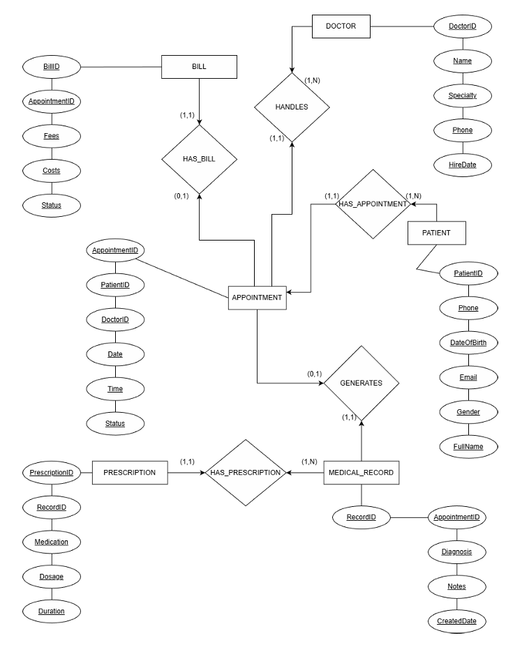

# Smart Clinic Management System - Database
## Overview

This project presents the design and implementation of a Smart Clinic Management System database.

The system manages:

- Doctors
- Billing
- Patients
- Appointments
- Prescriptions
- Medical Records

The database design includes ER modeling, relational schema conversion, normalization (3NF / BCNF), and SQL implementation.

## System Entities

1. BILL
2. DOCTOR
3. PATIENT
4. APPOINTMENT
5. PRESCRIPTION
6. MEDICAL_RECORD

## Relationships

- Each Appointment has exactly one Bill (1:1)
- One Doctor can have many Appointments (1:M)
- One Patient can have many Appointments (1:M)
- One Medical Record can have many Prescriptions (1:M)
- One Appointment generates at most one Medical Record (1:1)

## Database Design

The database was designed using ER modeling and converted into a relational schema.

All tables include:

- Primary Keys
- Foreign Keys
- Proper cardinalities
- Business rules constraints

## Normalization

All relations satisfy:

- Third Normal Form (3NF)
- Boyce-Codd Normal Form (BCNF)

There are no partial or transitive dependencies.

## SQL Implementation

The project includes:

- DML (INSERT sample data)
- UPDATE and DELETE commands
- DDL (CREATE TABLE statements)
- SELECT queries (joins, subqueries, aggregation)

## ER Diagram

